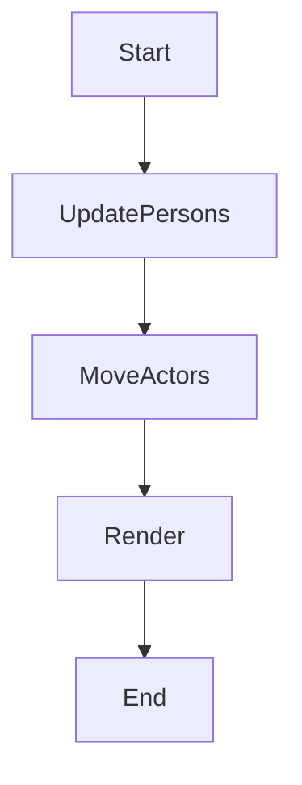

# Fluxo do GameLoop

```mermaid
flowchart TD
    Start --> UpdatePersons
    UpdatePersons --> MoveActors
    MoveActors --> Render
    Render --> End
```

O diagrama acima resume as etapas principais do `GameLoop`: atualizar cada pessoa, mover no mapa e, opcionalmente, renderizar o estado.
