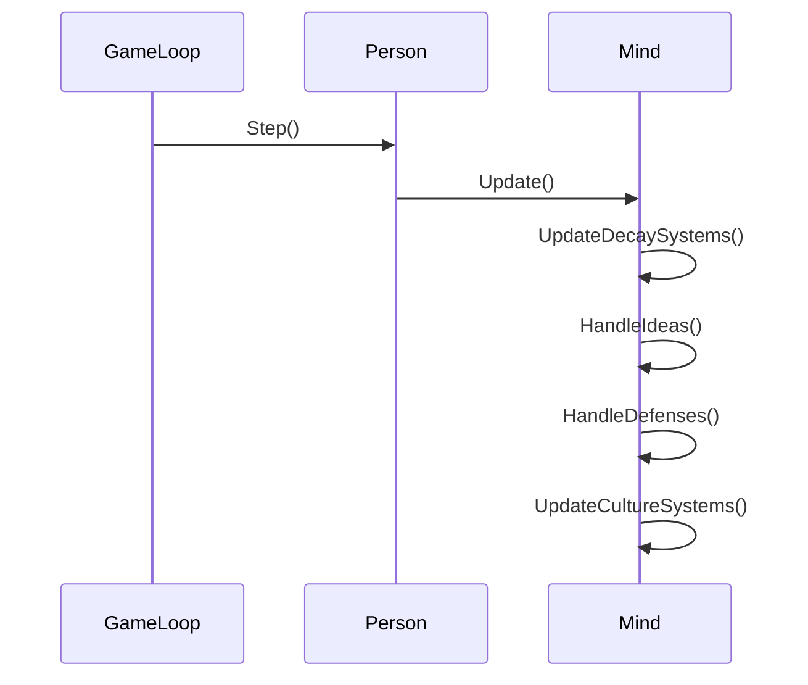

```mermaid
sequenceDiagram
    participant G as GameLoop
    participant P as Person
    participant M as Mind
    G->>P: Step()
    P->>M: Update()
    M->>M: UpdateDecaySystems()
    M->>M: HandleIdeas()
    M->>M: HandleDefenses()
    M->>M: UpdateCultureSystems()
```
