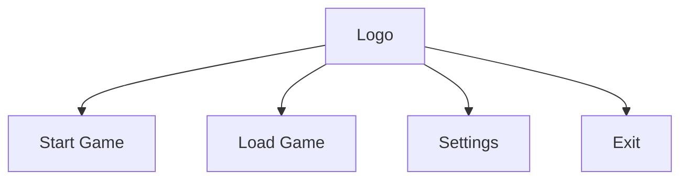

# UI Mockups

The following diagrams outline potential layouts for the game's user interface. These sketches illustrate menus, windows and interactions to guide design discussions.

## Main Menu


## In-Game HUD
```text
+---------------------------------------+
| Health: [||||||||  ]  Mana: [|||     ]|
| Inventory [I]  Map [M]  Quests [Q]   |
+---------------------------------------+
|                                       |
|         (game world viewport)         |
|                                       |
+---------------------------------------+
```

These mockups are simple references. Actual assets should be implemented by the UI team using the game's rendering system.
